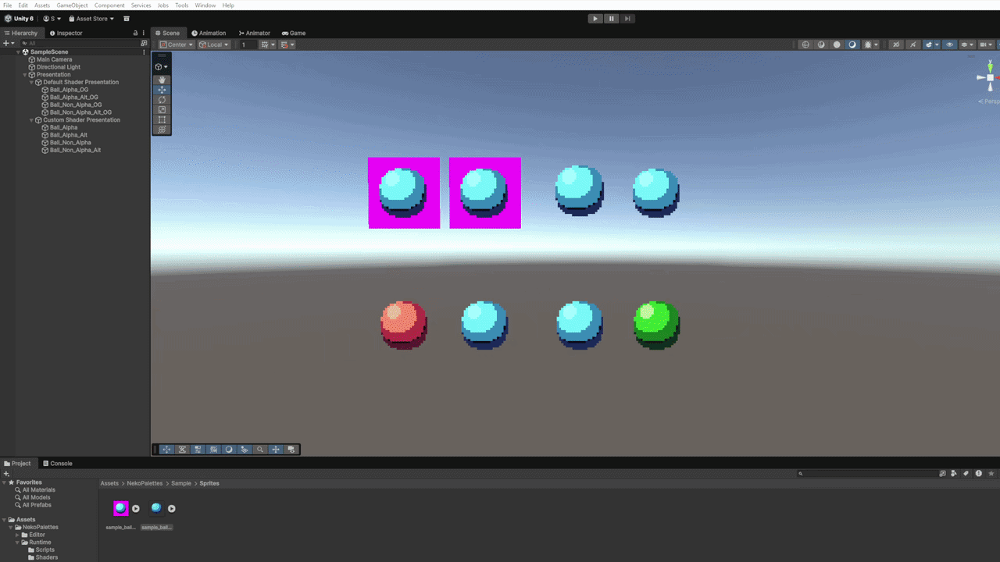

# NekoPalettes
> A lightweight palette authoring and GPU palette-swapping workflow for retro sprites in Unity.

NekoPalettes lets you create, preview, bake, and use color palettes directly inside Unity, without needing to open an external image editor for every palette variant.

This tool was designed with retro and pixel-art workflows in mind. It uses indexed textures and GPU palette lookups to keep sprite variants compact while allowing palettes to be changed at runtime.

## 🧩 Features
- Live palette creation directly inside the Unity Editor (*Tools > NekoPalettes > Palette Generator and Editor*)
- Live preview of palette changes on the selected sprite
- Project-ready palette export (no manual texture import configuration required!)
- Automatic indexed sprite baking into an R8 texture
- GPU-based runtime palette swapping
- Runtime chroma keying for sprites without an alpha channel
- Combined palette swap + chroma key shader

---
This image shows the kind of results you can expect from NekoPalettes using chroma keying and palette swapping:

## 🛠️ Workflow
NekoPalettes is designed around a simple and accessible workflow:

1. Select a sprite in Unity
2. Make sure to **bake the sprite**. The generated indexed sprite is the texture you assign to your `SpriteRenderer`.
3. Create or edit a palette directly in the NekoPalettes Editor
4. Preview the palette on the sprite in real time
5. Export the palette for use in your project
6. Assign the PaletteSwapper script to your GameObject and assign the palettes. Also make sure to assign the `PaletteSwap` material to the `SpriteRenderer`.
7. Click "Apply Palette Swap" to preview the result directly in the editor!

---

This demo shows how to create a palette using the custom editor, preview it live, and export it into your project.

 ## 💭 Why NekoPalettes?

Palette swapping is a technique with a long history in retro games, where storing multiple full-color versions of the same sprite was often impractical. NekoPalettes brings that idea into a modern Unity workflow, making indexed-color rendering and runtime palette swapping accessible without requiring specialized graphics knowledge.

## 🎯 Who is this for?
NekoPalettes is primarily intended for retro and pixel-art Unity projects, especially workflows involving small sprites and many palette variants.
It can be useful for:
- Pixel-art game developers
- Unity artists
- Developers who don't want to rely on an external image editor for palette authoring
- Developers interested in reducing asset size
- Retro hardware and rendering enthusiasts
- Anyone interested in indexed-color rendering and palette-based graphics

## 📦 Installation
> NekoPalettes is distributed as a Unity package.

To install NekoPalettes:
1. Open the Unity Editor and go to *Window > Package Management > Package Manager*
2. Click the "+" icon on the top left of the window. Click on "Install package from git URL"

3. Finally, enter this link: `https://github.com/im-shadee/NekoPalettes.git?path=/Package`, and press "Install". Done!

---
**⚠️ This package also includes test assets and examples intended to show how to create your own swappable sprites.**
To install them, go back to *Window > Package Management > Package Manager*, click on "NekoPalettes", and finally, go to the "Samples" tab. Click on "Import".

## 📄 License
NekoPalettes is released under the MIT License.

You are free to use, modify, distribute, and fork the project, including in commercial projects.
See `LICENSE` for the complete license text.

## 💭 Developer Note

This project is something I've always wanted to make ever since I started learning Unity a year ago. It's the kind of tool I wish I'd had when I was starting out, and it's also my first public project. I hope it brings some joy to the optimization and retro-tech nerds out there. Thanks for using NekoPalettes!

Special thanks to my friend `@rlbishop99` for testing and QA this tool before releasing it to the public.
